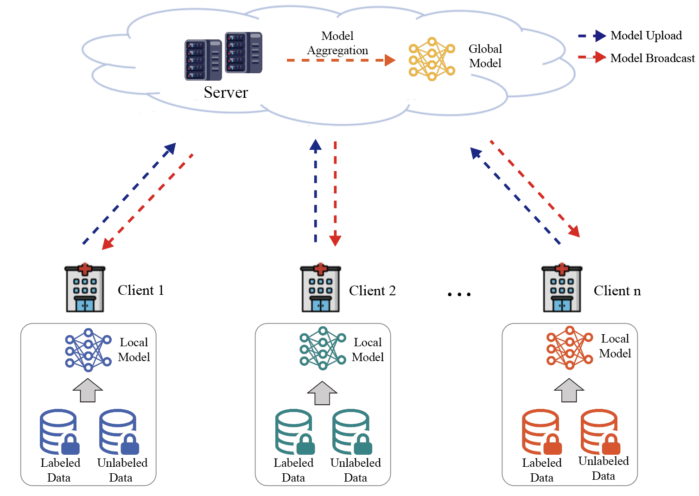

# FV2IC
FV2IC is a universal federated semi-supervised image segmentation framework suitable for scenarios where each client possesses a certain proportion of labeled data.

Experimental results across three distinct medical imaging datasets demonstrate the effectiveness of FV2IC.

Run "python federated.py" to obtain the experimental results (20% labeled) on the ACDC 2017 dataset as described in the paper "Federated Semi-supervised Learning for Medical Image Segmentation with Intra-client and Inter-client Consistency."
